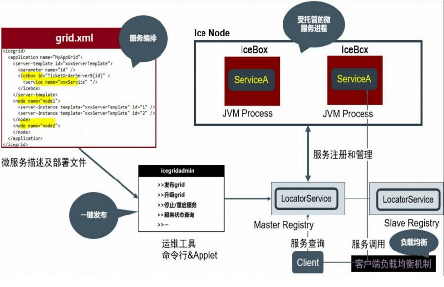
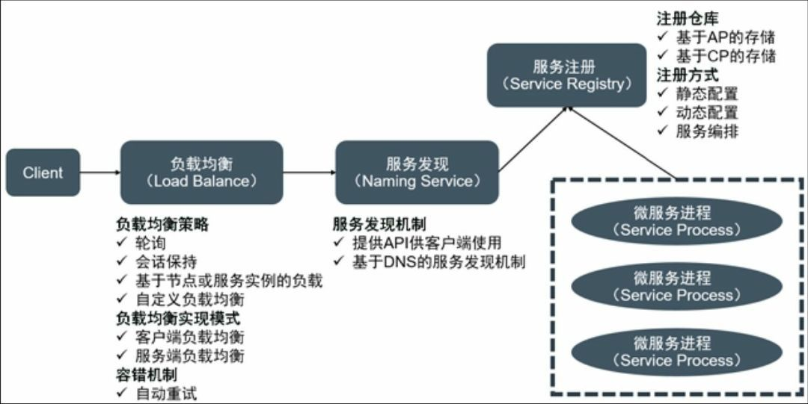
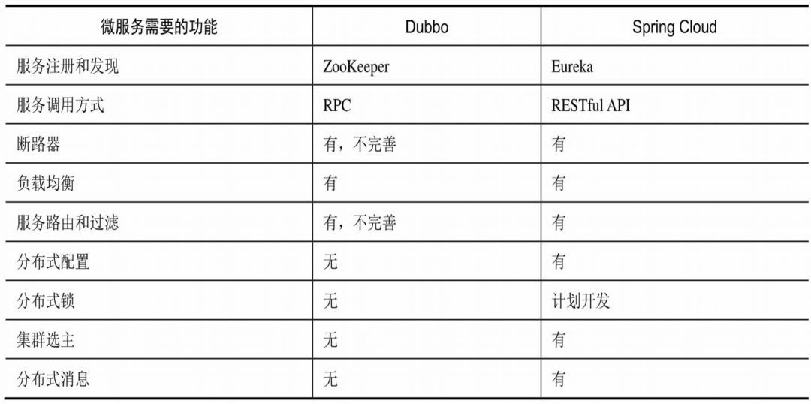
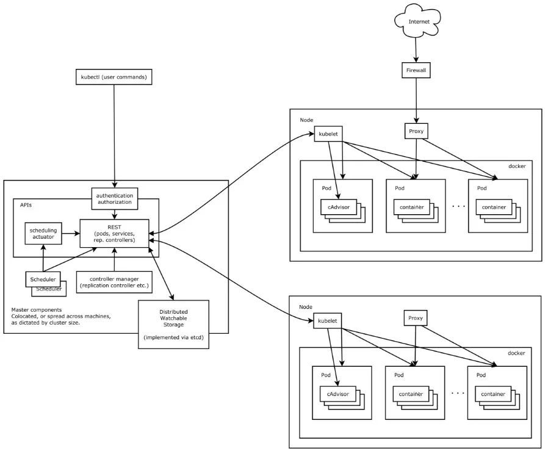
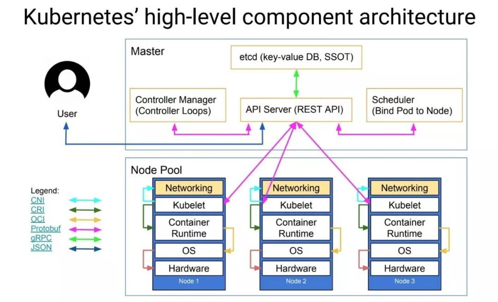

## 微服务与ICE

容器和微服务相辅相成，两大技术成熟的时间点非常契合。容器技术的成熟为微服务提供了得天独厚的客观条件。轻量化的容器是微服务的最佳运行环境，微服务应用只有在容器环境下才能保障运维效率的提升。同时，微服务应用架构对外在组件的管理会变得困难，需要用容器平台去管理中间件，才能发挥出更大价值。

在分布式技术发展早期，出现过一个基于RPC技术的“伟大的分布式平台”，这个平台的梦想是实现所有语言、所有平台、所有厂商的各种IT系统的分布式互联互通，这就是CORBA，可惜这个由IBM、Sun Microsystems、苹果、微软等IT公司联手发起的伟大创举最终失败。

之后，

 

从图可以看到，`IceGrid`具备微服务架构的核心特性。

+ 服务编排：`IceGrid`采用XML方式定义服务及服务的部署拓扑，通过命令行工具一键发布。
+ 服务托管：`IceGrid`中的“微服务”运行于`IceBox`这个容器中， 由容器托管整个服务的生命周期，包括启动服务、停止服务、升级服务等过程。
+ 服务注册：`Ice Registry`实现服务注册功能，支持静态配置与动态注册两种机制，并且可以配置一主一从的集群，避免单点故障。
+ 服务路由与负载均衡：采用客户端负载均衡机制，在客户端`SDK`里内嵌实现，无须编程，具有基于主机负载、轮询等多种负载均衡方式。
+ 平台运维：基于命令行与`Java GUI`工具，常用的运维命令都已经内置实现，用户也可以根据ICE提供的管理API来实现定制化的Web运维工具。
 

总体上，微服务架构平台的核心组成就是上述组件，下图所示为典型的微服务架构平台的结构示意图。
 

 

在IceGrid之后，比较有影响力的开源微服务架构框架有`Dubbo`与 `Spring Cloud`，两者都是Java语言体系内的微服务框架，并不支持其他语言。与IceGrid相比，其完备性还达不到平台（Platform）的高度，目前只能被称为框架（Framework）。下表给出了Dubbo 与Spring Cloud的主要功能对比。

 

 
`Spring Cloud`相对而言更加全面，开源更有保障，同时开创性地实现了微服务架构框架中诸如断路器、流量仪表板、服务网关等特性，同时提供了在分布式开发中所需的很多基础组件（API），例如配置管理、全局锁、分布式会话和集群状态管理等。Spring Cloud的核心是原来在 Netflix 公司内部广泛使用、经过实践考验、非常成熟的微服务框架——Netflix OSS，所以，Spring Cloud一度吸引了很多人的眼球。
 
## 基于K8S的容器平台

在Spring Cloud之后成功的微服务架构基本都与容器技术挂钩了，其中最成功、影响也最大的当属Kubernetes平台了，与之相似的还有Docker公司推出的Docker Swarm（在2017年年底，Docker Swarm 也支持Kubernetes了）。

对比Kubernetes与IceGrid，我们会发现两者有很多相似性。

+ • 每台主机上的Kubelet Daemon进程相当于Ice Node守护进程。
+ • Kubernetes API Server进程相当于Ice Registry。
+ • 每个运行的容器相当于一个IceBox进程。
+ • Kubernetes中的微服务Service相当于IceGrid中的Service。
+ • Kubernetes的YAML资源定义文件相当于ICE中的grid.xml。
+ • kubectrl客户端命令行工具相当于Icegridadmin工具。

 
Kubernetes与IceGrid在微服务架构基础设施方面有以下两个显著区别。
+ • Kubernetes没有提供一个用于服务调用的“RPC框架”，这样的好处是任何语言和网络协议（只要是TCP/UDP之上的协议）都可以在Kubernetes微服务架构平台上建模与运行，缺点是缺失的这一层需要应用自己去解决。
+ • Kubernetes里的服务路由与服务负载均衡是通过“代理”来实现的，即是由位于每个Node节点上的kube-proxy来完成的，而非客户端的负载均衡机制。
 
那么，在采用微服务架构模式后都有哪些好处呢？如下所述。
+ • 通过把巨大的单体应用分解为多个微服务组件的方式解决了复杂度的问题。在功能不变的情况下，整个应用被分解为多个基于接口驱动的可独立设计、施工的子工程，这样一来，每个微服务工程的规模变小、功能内聚，技术相对单一化，更容易去理解和并行开发。
 
+ • 微服务架构使得每个服务都可以由专门的开发团队并行独立设计、开发、升级及运维，开发者可以自由选择开发技术甚至开发语言，以更好地实现目标。最为关键的是，这种自由意味着开发者不需要被迫使用该项目在一开始时采用的过时技术（比如3年前的旧框架），可以选择现在主流或流行的新技术。甚至，因为服务的功能相对简单、单一化，代码量并不复杂，也不难准确理解服务的业务逻辑，即使用现在的技术重写以前老旧的代码也不是很困难的事情。
 
+ • 微服务架构模式可以做到每个微服务独立部署，这种改变可以加快部署。开发者不再需要协调其他服务部署对本服务的影响，UI团队可以采用A/B测试，快速部署新版本以加速测试。微服务架构模式使得持续化集成与发布部署成为可能，因此DevOps的实施在更多 的时候需要首先将系统微服务化。
 

我们知道，任何技术都有两面性，即优点与缺点并存，那么，微服务架构的最大缺点是什么呢？
 
答案是大大增加了开发工作量并带来了固有的复杂性。比如，开发者需要掌握某种RPC通信技术，并且在
客户端的逻辑中增加远程服务的调用代码，在某些情况下，他们必须通过写代码来处理RPC速度过慢或者调用失败等复杂问题。
 
相对于在单体应用中仅需在编程层面进行方法调用就可以访问其他服务，微服务架构中的服务调用方式则显得更加复杂和难以捉摸。因此，一个单体应用或者简单的分布式系统要想彻底微服务化，其代价还是很大的。
 
因此企业在判断自己的应用是否需要微服务化的时候，需要综合考虑应用的重要性、改造的代价与收益、技术风险等，综合考虑是否有必要将某个单体应用或者一般的分布式架构应用改造成微服务架构的应用。毕竟，改造是有成本的，而且改造完毕之后，也无法保证能够解决所有问题。
 
我们知道，在当下而言，微服务基本上是和容器绑定在一起的，微服务化之后的应用一般而言是需要运行在容器上的。而一个具有一定规模的单体应用，微服务化之后，可能对应成百上千个微服务，这些微服务的资源调度、更新发布、运维管理、销毁回收、自动扩缩容等等综合起来会变成一个很庞大的工作量，如何应对呢？
 
答案是使用K8S为核心的构建的容器平台，来进行整体的用来支撑微服务化应用的容器的管理。这里面涉及到资源的管理，例如计算资源、网络资源、存储资源、镜像资源；同时还涉及到微服务应用层面的管理，例如应用的创建、应用的部署管理、应用的弹性伸缩管理、应用的日志管理和监控管理；另外，还包括与其他流程或者工具链的打通，比如与DevOps流程的集成和打通，与企业现有日志管理平台的集成与打通，与企业监控和告警平台的集成与打通，与企业备份系统的集成和打通，以及与企业的大数据、数据挖掘等平台的集成与打通。
