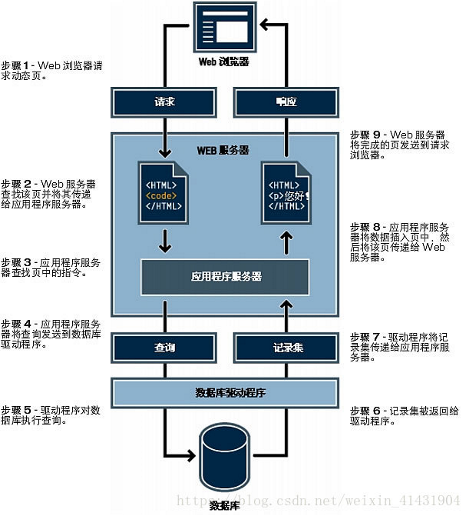
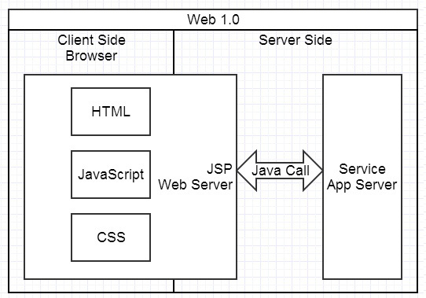
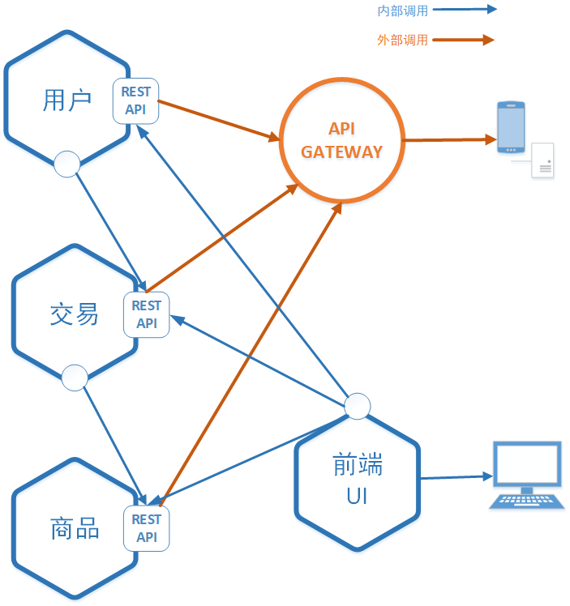
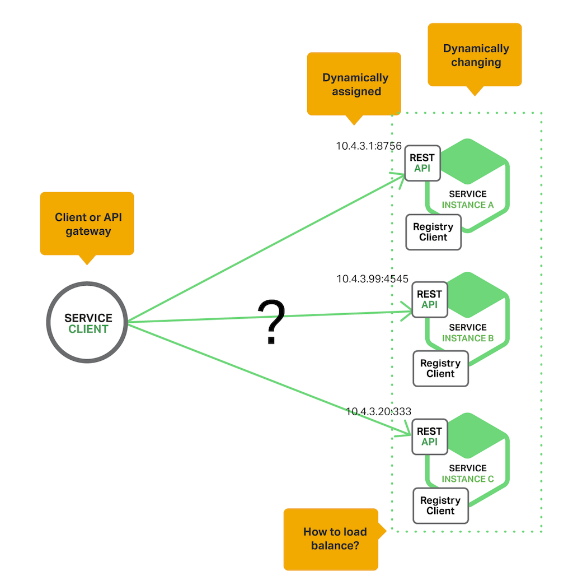
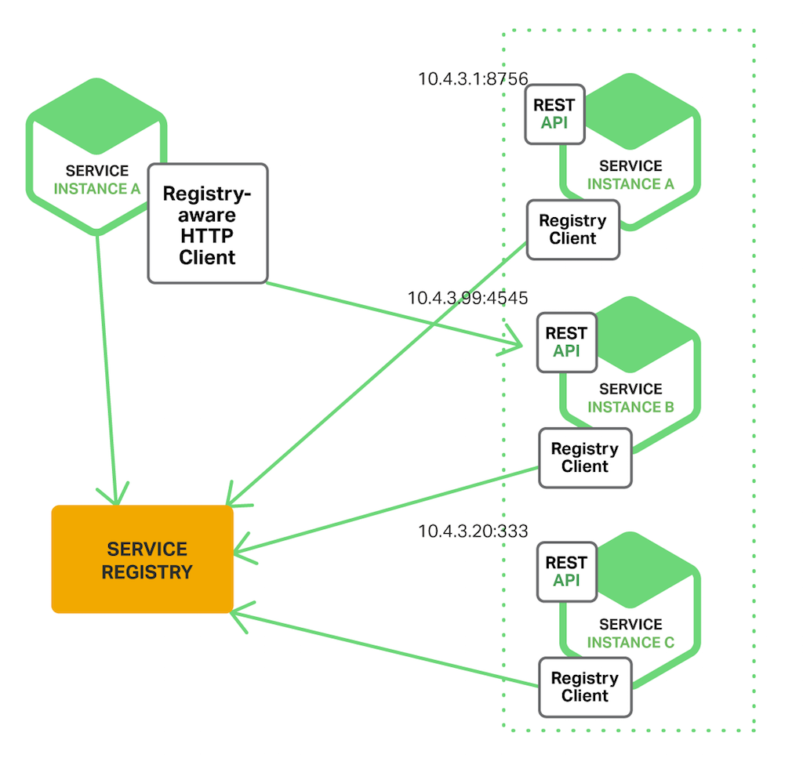

## 微服务入门与实现方式
本文将简要介绍微服务的概念以及微服务产生的原因，然后会介绍微服务目前主流的实现方式，接着结合k8s（容器服务平台）介绍目前如火如荼的SeviceMesh技术，最后介绍腾讯基于虚机的seviceMesh的技术要点。希望读者可以通过此文了解微服务的基本概念，同时了解微服务中网络相关的基本知识。
### 1.为什么微服务

### 1.1 网站基础知识

微服务主要产生于互联网网站构建，可以说是互联网业务发展到今天的必然产物。因此想要理解微服务，必须先有一些网站的基本知识，我们先介绍一个网站的基本组成以及如何开发一个网站。

+ **网站组成**



如图所示，一个网站的组成其实非常简单，主要由web服务器和数据库两部分组成，web服务器上跑着网站的应用程序对用户通过浏览器发起的访问做出处理,通常我们把这种应用程序叫做web应用。而数据库用于存储数据，非必需。


我们先来看看它是如何工作的，当我们当我们输入网址到浏览器之后，发生了什么。这里只做简要说明，忽略了域名转换，负载均衡等网络转化操作。
当我们输入`www.baidu.com`到浏览器中：
```
1）浏览器通过DNS域名解析到web服务器IP；
2）浏览器通过TCP/IP协议建立到服务器的TCP连接；
3）浏览器向服务器发送HTTP协议请求包，请求服务器里的资源文档；
4）web服务器向客户机发送HTTP协议应答包，如果请求的资源包含有动态语言的内容，那么服务器会调用动态语言的解释引擎负责处理“动态内容”，并将处理得到的数据主要是html文档返回给客户端；
5）浏览器与服务器断开。由浏览器解释HTML文档，在客户端屏幕上渲染图形结果；
```
+ **网站的开发**

网站开发就是要写一个web服务器，web服务器与普通服务器并没有什么差别，通常我们把部署了基于web开发的应用程序的服务器称为把服务器。

而web应用程序通常是通过web框架开发的，我们知道网页都是基于http或者https协议的，而web框架的作用之一就是给开发人员提供了协议框架，就跟socket封装了tcp/ip协议一样，开发人员直接使用即可，不必再关注协议层。同时我们知道浏览器只认识html文档（后来有CSS，JS)，因此一些高级的框架提供了方便生成与处理html的处理接口，帮助开发人员开发。简单说，其实开发一个简单的网页非常简单，如图所示，页面由 JSP、PHP等框架在服务端生成，浏览器负责展现。基本上是服务端给什么浏览器就展现什么，展现的控制在由web服务器（Web Server)完成。


举一个具体的例子，马云创业初期创办了一个叫中国黄页的网站，大概的功能就是可以在网页上查询各类电话号码。


如图所示这种纯查询的网站逻辑非常简单，web应用程序中写好了html模板。主要的执行程序在controller中，当浏览器发起请求时，它负责从数据库获取数据，然后填充进html模板，生成最终的html返回给浏览器，浏览器完成渲染显示。

这样的web应用程序，逻辑简单，代码程序3~4个人就进行维护开发，根本谈不上使用微服务这种概念，因为本身已经足够微小。

### 1.2 传统网站的问题
很快马总发现，这个网站根本无法挣钱，内容和形式都太过于简单。于是他开始做电商网站。


这时候webapp的业务逻辑变得异常复杂， 除了渲染页面，还需要处理用户、商品、交易等逻辑，那时候并没有微服务概念，和以前的想法一样， 将这些处理逻辑都在写在同一个webapp中，那时候网站刚刚运营，业务逻辑还小，虽然都写在了一起，整个webapp并不是很大，因此显得并没有什么问题，并且这种方式最终只有一个应用程序，部署维护也非常简单，在访问量不大的情况下，甚至直接部署到一台服务器上即可对外提供服务。

一切的变化都来自于业务量的剧增，电商网站变得异常火爆，为了迎合需求，越来越多的功能被添加进来，功能的增加意味着代码量的增加，webapp的代码量也随之增长，几年的开发下来，突然发现，原本简单的应用，几乎变成了一个巨大的单体怪物。问题开始慢慢显现：

+ 迭代维护周期变慢

应用太大，已经很难有一个程序员能够完全理解整个应用，修改bug和开发新功能都变的无比麻烦，任何的修改都仿佛在创造更大的bug，同时加剧这个应用的复杂性，这其实是一个恶性循环，这样的应用最终将变得没有任何可用性。

+ 大应用启动慢，加剧交付负担

应用程序的规模大了也会拖慢程序的开发： 程序越大，启动越慢！调查显示一些程序员说他们启动程序要12分钟，我个人还听过有的应用启动要40分钟！程序员开发过程需要周期性的重启应用，这样就浪费了很多时间，效率自然也很低下，不能忍！

巨大、复杂的单体应用还是持续交付的巨大障碍。现在SaaS应用的宗旨是如果有改动能够每天部署多次。单体应用的中某部分的改动需要需要重新部署整个应用，这样的话持续交付是相当困难的。前面也讲了，启动一次就要那么久 ！另外，改动造成的影响也不是很好被理解，需要大量的手工测试去保证，这样的话持续交付更是难上加难了！

+ 资源需求不对称，横向扩展困难

单体应用在多个模块对资源需求上有冲突时很难进行扩展。比如：一个新模块可能实现了CPU密集型的图片处理逻辑,更适合部署到cpu资源充足的服务器上。另一个模块可能需要一个内存数据库，存储服务器上。然而，这些模块必须被一起部署的话，选择硬件的时候就要好好折中一下喽。

+ 稳定性下降

单体应用的另一个问题是稳定性：因为所有的模块都跑在同一进程之中，某模块中的bug，比如内存泄漏是可能拖垮整个应用的！更重要的是，因为负载均衡后面的所有的应用是一样的，bug还可能影响整个应用的可用性！

+ 技术更新缓慢

单体应用很难拥抱新的框架和编程语言。假设你有2百万行用XYZ框架写的代码，如果用ABC框架重写它将会耗费巨大的时间和金钱！哪怕大家都知道用新框架更适合一些。这样导致的结果是，在尝试转换新框架新技术的时候存在巨大的障碍，我们不得不继续在选型之初定好的技术架构上前行。

### 1.3 微服务的优势

面对上述单体的应用的众多问题，微服务的概念被提出。


如图所示，这是目前大型网站的典型架构，主要的组成还是两大部分web服务器和数据库，但是我们看到结构已经发生了明显的变化，web服务器和数据库都被集群化。我们主要关注中间web服务集群，原本单体的web服务按照业务逻辑被拆分成用户，商品，交易三个独立的小服务，他们单独部署单独运行在各自的服务器集群中，并且根据业务的需要，都具备多实例的能力（图中为双实例)。每个独立的小服务都具备自己后端的数据库。他们直接通过暴露接口联系（通常时Restful接口),每个小服务都可以单独开发，单独维护，只需要统一好接口即可。

这种微服务架构模式有很多重要的优势。首先，通过把可怕巨大的单体拆分为一系列的服务解决了单体复杂度问题， 拆分后整体功能数量并没有变化，但是应用现在变成了多个方便管理的小应用，每个服务都有一个定义良好的服务边界，通过RPC方式或消息驱动暴露API。微服务架构模式解决了单体应用代码库在实践中极难模块化的难题，拆分后的微服务能够更快的部署，更易理解和维护！

第二，拆分后的服务可以被专注于某部分服务的团队独立开发。程序员可以基于API约定前提下自由选择合适的技术，当然，很多机构为了避免技术选择混乱也会限制技术的选项。因此，自由意味着程序员可以不再局限于项目初期选择的技术了（撒花）！开始写一个新的微服务的时候，开发者可以使用一些当下流行的技术，更重要的是，因为每个服务现在拆分的很小，使用现有技术重写老的服务成为可能！

第三，微服务架构模式使得独立部署成为可能，开发者不用再忙碌于协调其他模块的变化再去部署（单体应用，改一个部分可能对其他部分影响，某个更改可能涉及多个模块的协调），微服务的更改可以在测试后尽快的被部署。比如，UI组可以进行A/B测试并且快速迭代而不用等待整个应用部署。微服务架构模式使得持续部署成为可能！

第四，微服务架构模式使得每个服务可以独立的扩展。我们可以针对某些有容量和可用性要求的微服务进行扩展，为需要的服务部署多个实例而不是复制多个单体去折中获得某项提升！更重要的是，我们可以针对服务需求使用最合适的硬件资源。

第五，微服务的拆分使得服务复用变得非常简单，现在有淘宝，后面要构建天猫网站时，其实用户和交易模块逻辑几乎时相同的，完全可以直接调用即可，往后的网站构建只需要更换前端的界面，后端的逻辑根本不需要改变，更加极端的例子，假如需要开发一个手机淘宝的App，根本不需要再为手机淘宝准备一个后端，只需要开发app界面即可。


上面简单介绍了web应用的基础知识，并且指出了传统的单体网站的弊端，同时引出了微服务概念及其基本的优势，下面介绍微服务在实现过程中的问题以及目前的常用实现方式。

### 2.微服务实现方式

前文介绍了微服务的众多优势，当然软件开发`没有银弹`(没有必杀技),微服务也有各种问题需要解决，因此就有个各种方便开发人员实现微服务开发的框架和平台等。让开发人员可以更加容易的将自己的应用微服务化。



如图所示，是一个微服务架构的应用的典型构成，应用被分成用户、交易、商品和前端页面四个微服务，每个微服务后面可能都是多实例的，通过`REST API`统一向外暴露接口提供服务，当然前端页面通常只会调用后端的服务做最终展示。

应用微服务需要解决的大多数问题都是网络问题，即服务间如何调用的问题。在单体应用时用户和交易等的交易逻辑都在同一个进程中，直接调用即可实现联系。当微服务后，用户和交易的逻辑不仅不在同一个进程中，甚至部署在两台服务器上。这时候需要解决两个问题，内部调用与外部调用，内部调用主要需要解决部署在同一个局域网或者VPC中的服务组间调用，而外部调用主要需要解决部署在内部网络的微服务如何跨域别外部网络调用。

首先是协议，我们知道每个微服务其实都是一个web应用，他们都可以通过http协议对外提供访问，因此我们很容易的想到利用http协议来进行服务间的调用协同，事实上，大多数情况下我们也是这么做的，在http协议规范上提出了Restful Api的接口规范。

内部调用相对简单，因为内部网络本身就是直连，且相对安全稳定，通常通过http协议直接进行通信即可。而外部调用则相对负载一些，需要将内部服务暴露给公网调用，如果同样采用直连方式显然并不合理，外网用户可以直接访问到后端服务，这样非常容易受到攻击切也不好做鉴权限流等操作，目前常规的做法是将后端服务想要暴露给外网用户的接口统一注册到API GATEWAY,由API GATEWAY,统一对外，并且提供鉴权限流等能力。

+ 什么是Restful APi ?

`REST`本质上是使用URL来访问资源的一种方式。众所周知，URL(Uniform Resoure Locator:统一资源定位器)就是我们平常使用的请求地址了，其中包括两部分：请求方式与请求路径，比较常见的请求方式是GET与POST，但在REST中又提出了几种其它类型的请求方式，汇总起来有六种：`GET、POST、PUT、DELETE、HEAD、OPTIONS`。尤其是前四种，正好与CRUD（Create-Retrieve-Update-Delete，增删改查）四种操作相对应，例如，`GET（查）、POST（增）、PUT（改）、DELETE（删）`，这正是REST与CRUD的异曲同工之妙！需要强调的是，REST是面向资源(ROA)的，这里提到的资源，实际上就是我们常说的领域对象，在系统设计过程中，我们经常通过领域对象来进行数据建模。
REST是一个无状态的架构模式，因为在任何时候都可以由客户端发出请求到服务端，最终返回自己想要的数据，当前请求不会受到上次请求的影响。也就是说，服务端将内部资源发布REST服务，客户端通过URL来定位这些资源并通过HTTP协议来访问它们。下面我们举几个例子对REST请求进行简单描述：

可见，请求路径相同但请求方式不同，所代表的业务操作也不同，例如，/advertiser/1这个请求，带有GET、PUT、DELETE三种不同的请求方式，对应三种不同的业务操作。

+ 服务注册和服务发现

上述介绍了Rest的接口规范，我们已经可以根据不同的URL来访问到不同的服务逻辑，但其实我们忽略了一个问题，就是服务器地址，我们去哪台服务器上访问这些资源？当然我们可以想到的一个简单方式就是`ip+端口`的方式，将需要调用服务的服务器的ip与端口都硬编码进需要调用的程序，于是一个接口的完整的调用路径应该是这样的`172.1.1.23:80/advertiser/1`。这种方式简单方便，在微服务下并不适用。微服务的应用通常生命周期非常不稳定，一个微服务通常都是具备多个实例的，每个实例都对应着一台服务器（通常是虚拟机），他们的IP都是动态分配的，更糟糕的是根据业务的需要，这些实例会自动扩展、失败或者升级发生动态变化。如下图所示，


这时候采用硬编码的方式显然已经无法满足调用要求，因此就引出了微服务的两个概念`服务注册`与`服务发现`。我们采用IP注册发现的方式来解决IP不固定的问题

**服务发现**

主要有两种服务发现机制：客户端发现 和 服务端发现。

先介绍客服端发现模式，当我们使用客户端发现的时候，客户端负责决定可用服务实例的网络地址并且在集群中对请求负载均衡, 客户端访问服务登记表，也就是一个可用服务的数据库，然后客户端使用一种负载均衡算法选择一个可用的服务实例（其实就是获得其IP与端口）然后发起请求。



服务实例的网络地址在服务启动的时候被登记到服务注册表中 ，当实例终止服务时从服务注册表中移除。服务实例的注册一般是通过心跳机制阶段性的进行刷新。
客户端发现机制有诸多优势和劣势：该模式除了服务注册表之外没有其他的活动部分了，相对来说还是简单直接的，而且，由于客户端知道相关的可用服务实例，那么就可以使用更加智能的，特定于应用的负载均衡机制，比如一致性哈希。一个明显的缺点是它把客户端与服务注册表紧耦合了，你必须为每一种消费服务的客户端对应的编程语言和框架实现服务发现逻辑

然后我们来看服务端发现


客户端通过一个负载均衡器向服务发送请求，负载均衡器查询服务注册表并把请求路由到一台可用的服务实例上。和客户端发现一样，服务实例通过服务注册表进行服务的注册和注销。
类似NGINX PLUG和NGINX这些HTTP服务器和负载均衡器可以作为服务端发现负载均衡来使用。可使用Consul Template 动态重配置NGINX反向代理，Consul Template是一种根据存储在Consul 服务注册表的配置数据阶段性重新生成任意配置文件的工具 ，每当文件发生变化时，它将运行任意的Shell 命令。Consul Template 生成用于配置反向代理的nginx.conf文件，然后运行一个命令行告知NGINX重载配置。更复杂的实现可能使用 HTTP API or DNS动态重配置NGINX Plus。

一些部署环境使用诸如`K8S`(后文会进行详细介绍)集群中的每个主机上运行一个代理，这些代理扮演了服务端发现负载均衡的角色，代理可以根据主机IP地址和服务分配的端口号来路由客户端请求，代理因此可以透明的把客户端请求转发到集群中某台可用的服务实例上去。

服务端发现模式有一些优势也有一些劣势：一个巨大的优势是，服务发现的细节对客户端来说是抽象的，客户端仅需向负载均衡器发送请求即可。这种方式减少了为消费服务的不同编程语言与框架实现服务发现逻辑的麻烦。当然，正如前面所述，一些部署环境已经提供了该功能。这种模式也有一些劣势： 除非部署环境已经提供了负载均衡器，否则这又是一个需要额外设置和管理的可高可用的系统组件，尽管如此，服务端发现依然是目前主流方案。

**服务注册**

服务注册表 是服务发现的关键部分，它是一个包含服务实例网络地址的的数据库。主要用于将发布的服务的ip等信息注册这个发数据库中，一个服务注册表需要高可用和实时更新，客户端可以缓存从服务注册表获取的网络地址。然而，这样的话缓存的信息最终会过期，客户端不能再根据该信息发现服务实例。因此，服务注册表对集群中的服务实例使用复制协议来维护一致性。

目前已经用较多的开源组件来完成这个工作
+ etcd ，一个高可用、分布式、一致性、key-value 方式的存储，被用在分享配置和服务发现中。两个著名的项目使用了它：Kubernetes 和 Cloud Foundry.

+ consul ，一个发现和配置服务的工具，为客户端注册和发现服务提供了API，Consul还可以通过执行健康检查决定服务的可用性。

+ Apache Zookeeper ，是一个广泛使用、高性能的针对分布式应用的协调服务。 Apache Zookeeper本来是Hadoop的子工程，现在已经是顶级工程了。


### 3.微服务实现的一个具体例子
敬请期待....

### 4.iptables入门
敬请期待
### 5.七层负载均衡
敬请期待
### 6.sevicemesh原理
敬请期待

### 7.腾讯基于虚机的sevicemesh 
腾讯云 Service Mesh，遵循 Service Mesh 的理念进行设计，为应用提供服务自动注册发现、灰度路由、限流、熔断等服务治理能力，且应用无需对源码进行侵入式变更即可与该服务框架进行集成。
在实现上，基于业界达到商用标准的开源软件 Istio、envoy 进行构建。整体架构上，从功能逻辑上分为数据面和控制面：
控制面主要提供配置及控制指令支撑 sidecar 的正常运行，以及对服务运行过程中的相关数据进行采集。数据面主要是提供通信代理（sidecar）来进行透明的服务调用，支撑正常的业务流程。

接下来，让我们对腾讯云 Service Mesh 各关键点做详细的描述。


**解耦 k8s，拥抱其他计算平台**  
Istio 强依赖于 Kubernetes ，大部分功能都依托于 Kubernetes 平台进行构建。下面列举几个核心的功能：
(1) 服务配置管理：   Istio 配置通过 Kubernetes Crd (custom resources definition) 以及 configmap 进行存取


Istio 全功能的服务注册发现能力是基于 Kubernetes 的 PodServices 能力以及 Endpoints 机制实现的，节点健康检查能力基于 ReadinessProbe 机制实现 （当前社区上面也有基于 Consul 的服务发现机制实现，但是缺失健康检查机制）。


为了实现虚机的部署，必须与 Kubernetes 进行解耦。经过分析发现，脱离 Kubernetes 后，Istio 存在以下三个问题：
+ (1)Pilot/Mixer 的远程动态配置能力不可用（只能用本地配置）
+ (2)Pilot 无法获取服务节点健康信息
+ (3) 无法通过 Istioctl（Istio 小工具）进行服务注册 / 反注册以及写配置能力针对这 3 个问题，TSF对 Istio 的能力进行了扩展和增强，增强后的架构如下：


经过改造后，Service Mesh 成功与 Kubernetes 平台解耦，组网变得更加简洁，通过 REST API 可以对数据面进行全方位的控制，可从容适配任何的底层部署环境，对于私有云客户可以提供更好的体验。


**服务寻址模式的演进**
 
解决了跨平台部署问题后，第二个面临的问题就是服务的寻址互通问题。
Istio 下的应用使用 FQDN（fully qualified domain name）进行相互调用，基于 FQDN 的寻址依赖 DNS 服务器，Istio 官方对 DNS 服务器的说明如下：


Istio 的官方 demo（https://Istio.io/docs/examples/bookinfo/）中，Reviews 与 Ratings 之间的完整的服务调用会经过以下过程：


从图上可以看出，Reviews 和 Ratings 的互通，kube-dns 主要实现 2 个功能
+ (1) 应用程序的 DNS 请求被 kube-dns 接管
+ (2)kube-dns 可以将服务名解析成可被 iptables 接管的虚拟 IP（clusterIP）
在私有云的实际交付中，客户的生产环境不一定包含 Kubernetes 或者 kube-dns，我们需要另外寻找一种机制来实现上面的两个功能。

在 DNS 选型中，有集中式和分布式两种方案，分别如下：
集中式 DNS：代表有 ConsulDNS, CoreDNS 等，通过内置机制或者插件的方式，实现与服务注册中心进行数据同步。其架构组网如下，


kube-dns 也属于集中式 DNS 的一种，集中式 DNS 存在以下问题：组网中额外增加一套 DNS 集群，并且一旦 DNS Server 集群不可服务，所有数据面节点在 DNS 缓存失效后都无法工作，因此需要为 DNS Server 考虑高可用甚至容灾等一系列后续需求，会导致后期运维成本增加。
分布式 DNS：就是将服务 DNS 的能力下沉到数据平面中，其架构组网如下：


分布式 DNS 运行在数据面节点上，DNS 无单点故障，无需考虑集群容灾等要素，只需要有机制可以在其 down 掉后重新拉起即可。但是，由于其与业务进程运行在同一节点，因此其资源占用率必须控制得足够低，才不会对业务进程产生影响。
综合考虑，最终选用了分布式 DNS 的方案，最开始团队采用独立进程作为 DNS Server 的方案，如下图


该方案新增监听在 127.0.0.1:53 上的 mesh-dns 进程，该进程实时从 Pilot 同步服务列表。Mesh-dns 在节点启动时将 127.0.0.1 写入到 /etc/resolv.conf 首行中，同时接管 /etc/resolv.conf 的其他 nameserver。这样，当 app 发起 DNS 查询时，DNS 请求首先会到达 mesh-dns，遇到匹配服务名的查询则直接返回，而当遇到不是针对服务名的 DNS 查询时，就把 DNS 请求转发给其他 nameserver 进行处理。
该方案看起来简单可行，但是经测试验证后发现存在以下问题：
+ (1)resolv.conf 修改时间差问题：该方案需要对 /etc/resolv.conf 进行修改，在 linux 环境，域名解析机制是通过 glibc 提供的。而 glibc 2.26 之前的版本有个 BUG，导致假如在进程启动后，对 resolv.conf 就行修改，则该修改无法被该进程感知，直到进程重启。而由于在容器部署的场景中，mesh-dns 和应用分别部署在同一个 POD 的不同容器中，容器的启动是相互独立的，所以无法保证对 resolv.conf 的修改一定在应用启动前。即使改成通过 InitContainer 进行修改，当容器异常重启后，resolv.conf 也同样会被还原导致服务不可用。
+ (2) 端口监听冲突问题：由于 mesh-dns 必须监听 53 端口，假如客户节点环境已经安装了 dnsmasq 等同样需要占用 53 的进程，则可能会出现端口冲突导致启动失败。
+ (3)nameserver 选择策略问题：假如存在多个 nameserver，部分操作系统，默认会使用 rotate（随机选取一个作为首选查询的 nameserver）作为 nameserver 的选择策略。此时会出现一定概率下会选不到 127.0.0.1 的 nameserver，从而导致服务域名解释失败。
针对上述问题，对方案进行了进一步的优化，优化后的方案如下图：


mesh-dns 不再监听 53 端口，而是监听在 5353 端口（可配置），启动时无需修改 resolv.conf。通过增加 iptables 规则，将所有发往 nameserver 的流量导入到 mesh-dns，从而解决了上文中的“端口监听冲突”以及“nameserver 选择策略”的问题。
mesh-dns 通过 inotify 监听 /etc/resolv.conf，可以随时获取环境中 dns 配置的更改，从而解决了上文中的“resolv.conf 修改时间差”的问题。

**与非 Service Mesh 服务的互通**  
现实总是复杂的，前面解决 mesh 服务之间相互访问的问题，如何解决用户 Service Mesh 应用和其他非 Mesh 应用的相互访问呢？ 用户内部有不同技术栈，一部分服务基于 service  mesh 进行实现服务，另外一部分服务基于 spring cloud 框架进行实现。同时，客户的微服务组网中，存在大量第三方服务如支付网关、分布式存储、设备等，微服务需要与这些第三方服务也存在交互。用户期望支持的架构如下图所示：


这个架构中，最大的挑战在于涉及了两个不同的微服务框架之间的互通。但是，这两个微服务框架从架构模式、概念模型、功能逻辑上，都存在较大的差异。唯一相通的点，就是他们都是微服务框架，可以将应用的能力通过服务的形式提供出来，给消费者调用，消费者实际上并不感知服务的具体实现。
基于这个共通点，为了使得不同框架开发的服务能够正常工作，TSF将两个微服务框架，从部署模式、服务及功能模型上进行了拉通，主要包括如下几点：
+ (1) 服务模型的互通：基于统一的服务元数据模型，针对 pilot registry 及 spring cloud registry 的服务注册发现机制进行拉通
+ (2) 服务 API 的互通：基于标准 API 模型（OpenAPI v3），针对两边框架的 API 级别服务治理能力进行拉通
+ (3) 服务路由能力互通：基于标准权重算法以及标签模型，针对 pilot virtual-service 以及 spring cloud ribbon 能力进行拉通。
+ (4) 服务限流能力互通：基于标准令牌桶架构和模型，以及条件匹配规则，对 mixer 及 spring cloud ratelimiter 能力进行拉通。

**二进制协议的支持**  
在当前业界的开源 Service Mesh 产品中，主打的协议都是标准协议（HTTP1/2, GRPC），标准协议都有一个特点，那就是协议头中包含了目的端相关的所有信息，Service Mesh 会根据这些信息进行路由。如下表所示：

对于其他二进制协议，则分为 2 大类：
第一种是协议中带有目标端信息的二进制协议，如 thrift，dubbo 等；
第二种是协议中不带有目标端信息的二进制协议，这种就比较多了，一般常见于私有云中的各种私有通信协议。
开源 Istio 中，对于二进制协议的支持，仅仅局限于四层的端口转发，一般用于集成外部服务（mysql, mongodb 等），典型场景是对不同入口的流量做转发，如下图所示：


单纯的四层转发，无法满足复杂的微服务路由的需求。当前 TSF 交付的客户中，多个客户都提出了需要支持私有协议路由的需求，因此，针对这个问题，TSF 团队提供了两种解决方案。
+ (1) 用户将私有协议转换成 GRPC 协议，接入到 Service Mesh

由于 GRPC 的 Data Frame 本身传输的就可以是 TCP 协议，因此用户可以直接把自己的二进制协议通过 GRPC 的 bytes 类型编码，然后通过 Data Frame 传输过来.
该方案适用于本身有一定的技术积累，愿意去做 GRPC 改造的用户

+ (2) 根据用户定义的协议头描述文件，进行私有协议七层路由

中间件团队对 envoy 的 filter 进行了扩展，用户提供一个 protobuf 格式的描述文件，指定协议头的字段顺序，proxy 根据描述文件的定义，进行消息头的接收及解析，然后根据解析后的消息头内容，进行七层路由和转发。

该方案适用于自身带有目标端信息的二进制协议，可以让私有协议的用户无需任何的改造，即可接入 Service Mesh。
