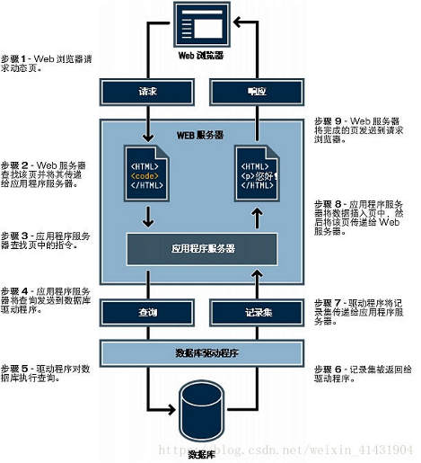
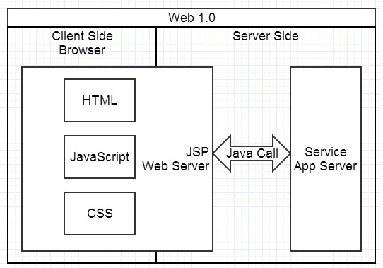
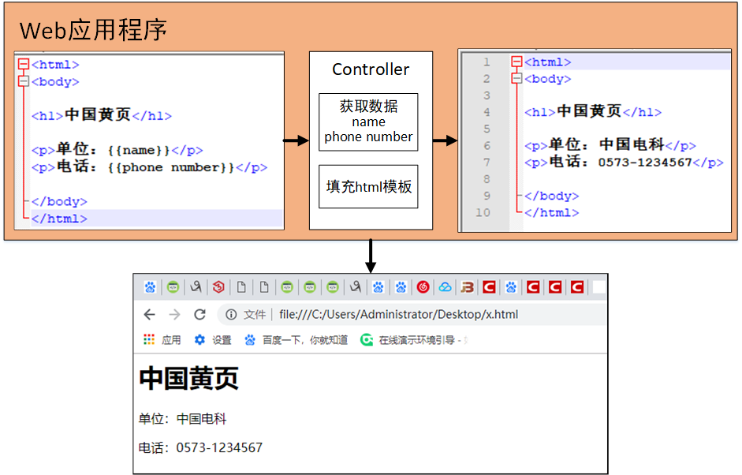
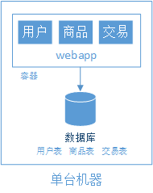
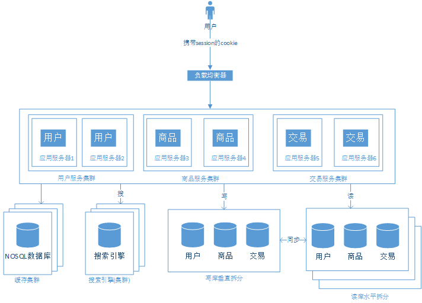
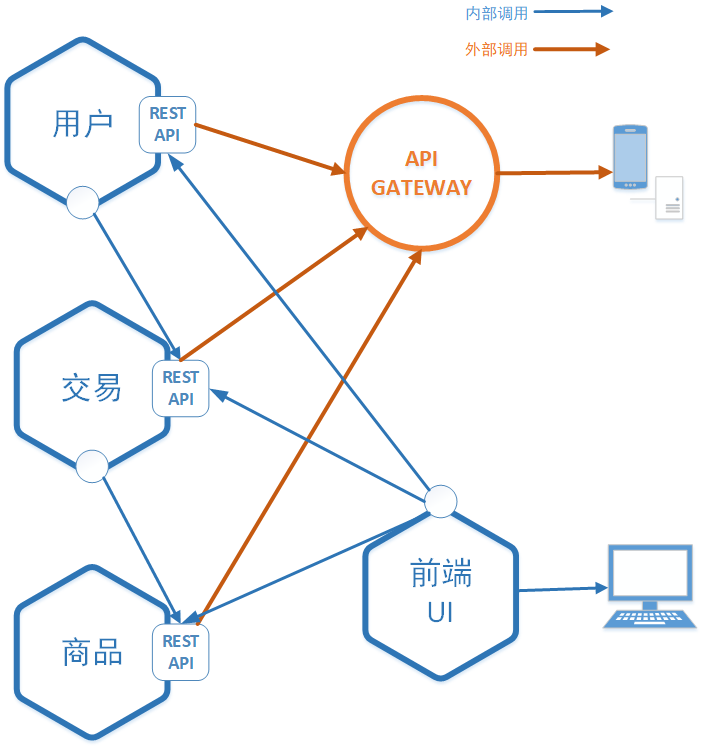

## 微服务入门与实现方式
本文将简要介绍微服务的概念以及微服务产生的原因，然后会介绍微服务目前主流的实现方式，接着结合k8s（容器服务平台）介绍目前如火如荼的SeviceMesh技术，最后介绍腾讯基于虚机的seviceMesh的技术要点。希望读者可以通过此文了解微服务的基本概念，同时了解微服务中网络相关的基本知识。
### 1.为什么微服务

### 1.1 网站基础知识

微服务主要产生于互联网网站构建，可以说是互联网业务发展到今天的必然产物。因此想要理解微服务，必须先有一些网站的基本知识，我们先介绍一个网站的基本组成以及如何开发一个网站。

+ **网站组成**



如图所示，一个网站的组成其实非常简单，主要由web服务器和数据库两部分组成，web服务器上跑着网站的应用程序对用户通过浏览器发起的访问做出处理,通常我们把这种应用程序叫做web应用。而数据库用于存储数据，非必需。


我们先来看看它是如何工作的，当我们当我们输入网址到浏览器之后，发生了什么。这里只做简要说明，忽略了域名转换，负载均衡等网络转化操作。
当我们输入`www.baidu.com`到浏览器中：
```
1）浏览器通过DNS域名解析到web服务器IP；
2）浏览器通过TCP/IP协议建立到服务器的TCP连接；
3）浏览器向服务器发送HTTP协议请求包，请求服务器里的资源文档；
4）web服务器向客户机发送HTTP协议应答包，如果请求的资源包含有动态语言的内容，那么服务器会调用动态语言的解释引擎负责处理“动态内容”，并将处理得到的数据主要是html文档返回给客户端；
5）浏览器与服务器断开。由浏览器解释HTML文档，在客户端屏幕上渲染图形结果；
```
+ **网站的开发**

网站开发就是要写一个web服务器，web服务器与普通服务器并没有什么差别，通常我们把部署了基于web开发的应用程序的服务器称为把服务器。

而web应用程序通常是通过web框架开发的，我们知道网页都是基于http或者https协议的，而web框架的作用之一就是给开发人员提供了协议框架，就跟socket封装了tcp/ip协议一样，开发人员直接使用即可，不必再关注协议层。同时我们知道浏览器只认识html文档（后来有CSS，JS)，因此一些高级的框架提供了方便生成与处理html的处理接口，帮助开发人员开发。简单说，其实开发一个简单的网页非常简单，如图所示，页面由 JSP、PHP等框架在服务端生成，浏览器负责展现。基本上是服务端给什么浏览器就展现什么，展现的控制在由web服务器（Web Server)完成。


举一个具体的例子，马云创业初期创办了一个叫中国黄页的网站，大概的功能就是可以在网页上查询各类电话号码。


如图所示这种纯查询的网站逻辑非常简单，web应用程序中写好了html模板。主要的执行程序在controller中，当浏览器发起请求时，它负责从数据库获取数据，然后填充进html模板，生成最终的html返回给浏览器，浏览器完成渲染显示。

这样的web应用程序，逻辑简单，代码程序3~4个人就进行维护开发，根本谈不上使用微服务这种概念，因为本身已经足够微小。

### 1.2 传统网站的问题
很快马总发现，这个网站根本无法挣钱，内容和形式都太过于简单。于是他开始做电商网站。



这时候webapp的业务逻辑变得异常复杂， 除了渲染页面，还需要处理用户、商品、交易等逻辑，那时候并没有微服务概念，和以前的想法一样， 将这些处理逻辑都在写在同一个webapp中，那时候网站刚刚运营，业务逻辑还小，虽然都写在了一起，整个webapp并不是很大，因此显得并没有什么问题，并且这种方式最终只有一个应用程序，部署维护也非常简单，在访问量不大的情况下，甚至直接部署到一台服务器上即可对外提供服务。

一切的变化都来自于业务量的剧增，电商网站变得异常火爆，为了迎合需求，越来越多的功能被添加进来，功能的增加意味着代码量的增加，webapp的代码量也随之增长，几年的开发下来，突然发现，原本简单的应用，几乎变成了一个巨大的单体怪物。问题开始慢慢显现：

+ 迭代维护周期变慢

应用太大，已经很难有一个程序员能够完全理解整个应用，修改bug和开发新功能都变的无比麻烦，任何的修改都仿佛在创造更大的bug，同时加剧这个应用的复杂性，这其实是一个恶性循环，这样的应用最终将变得没有任何可用性。

+ 大应用启动慢，加剧交付负担

应用程序的规模大了也会拖慢程序的开发： 程序越大，启动越慢！调查显示一些程序员说他们启动程序要12分钟，我个人还听过有的应用启动要40分钟！程序员开发过程需要周期性的重启应用，这样就浪费了很多时间，效率自然也很低下，不能忍！

巨大、复杂的单体应用还是持续交付的巨大障碍。现在SaaS应用的宗旨是如果有改动能够每天部署多次。单体应用的中某部分的改动需要需要重新部署整个应用，这样的话持续交付是相当困难的。前面也讲了，启动一次就要那么久 ！另外，改动造成的影响也不是很好被理解，需要大量的手工测试去保证，这样的话持续交付更是难上加难了！

+ 资源需求不对称，横向扩展困难

单体应用在多个模块对资源需求上有冲突时很难进行扩展。比如：一个新模块可能实现了CPU密集型的图片处理逻辑,更适合部署到cpu资源充足的服务器上。另一个模块可能需要一个内存数据库，存储服务器上。然而，这些模块必须被一起部署的话，选择硬件的时候就要好好折中一下喽。

+ 稳定性下降

单体应用的另一个问题是稳定性：因为所有的模块都跑在同一进程之中，某模块中的bug，比如内存泄漏是可能拖垮整个应用的！更重要的是，因为负载均衡后面的所有的应用是一样的，bug还可能影响整个应用的可用性！

+ 技术更新缓慢

单体应用很难拥抱新的框架和编程语言。假设你有2百万行用XYZ框架写的代码，如果用ABC框架重写它将会耗费巨大的时间和金钱！哪怕大家都知道用新框架更适合一些。这样导致的结果是，在尝试转换新框架新技术的时候存在巨大的障碍，我们不得不继续在选型之初定好的技术架构上前行。

### 1.3 微服务的优势

面对上述单体的应用的众多问题，微服务的概念被提出。


如图所示，这是目前大型网站的典型架构，主要的组成还是两大部分web服务器和数据库，但是我们看到结构已经发生了明显的变化，web服务器和数据库都被集群化。我们主要关注中间web服务集群，原本单体的web服务按照业务逻辑被拆分成用户，商品，交易三个独立的小服务，他们单独部署单独运行在各自的服务器集群中，并且根据业务的需要，都具备多实例的能力（图中为双实例)。每个独立的小服务都具备自己后端的数据库。他们直接通过暴露接口联系（通常时Restful接口),每个小服务都可以单独开发，单独维护，只需要统一好接口即可。

这种微服务架构模式有很多重要的优势。首先，通过把可怕巨大的单体拆分为一系列的服务解决了单体复杂度问题， 拆分后整体功能数量并没有变化，但是应用现在变成了多个方便管理的小应用，每个服务都有一个定义良好的服务边界，通过RPC方式或消息驱动暴露API。微服务架构模式解决了单体应用代码库在实践中极难模块化的难题，拆分后的微服务能够更快的部署，更易理解和维护！

第二，拆分后的服务可以被专注于某部分服务的团队独立开发。程序员可以基于API约定前提下自由选择合适的技术，当然，很多机构为了避免技术选择混乱也会限制技术的选项。因此，自由意味着程序员可以不再局限于项目初期选择的技术了（撒花）！开始写一个新的微服务的时候，开发者可以使用一些当下流行的技术，更重要的是，因为每个服务现在拆分的很小，使用现有技术重写老的服务成为可能！

第三，微服务架构模式使得独立部署成为可能，开发者不用再忙碌于协调其他模块的变化再去部署（单体应用，改一个部分可能对其他部分影响，某个更改可能涉及多个模块的协调），微服务的更改可以在测试后尽快的被部署。比如，UI组可以进行A/B测试并且快速迭代而不用等待整个应用部署。微服务架构模式使得持续部署成为可能！

第四，微服务架构模式使得每个服务可以独立的扩展。我们可以针对某些有容量和可用性要求的微服务进行扩展，为需要的服务部署多个实例而不是复制多个单体去折中获得某项提升！更重要的是，我们可以针对服务需求使用最合适的硬件资源。

第五，微服务的拆分使得服务复用变得非常简单，现在有淘宝，后面要构建天猫网站时，其实用户和交易模块逻辑几乎时相同的，完全可以直接调用即可，往后的网站构建只需要更换前端的界面，后端的逻辑根本不需要改变，更加极端的例子，假如需要开发一个手机淘宝的App，根本不需要再为手机淘宝准备一个后端，只需要开发app界面即可。


上面简单介绍了web应用的基础知识，并且指出了传统的单体网站的弊端，同时引出了微服务概念及其基本的优势，下面介绍微服务在实现过程中的问题以及目前的常用实现方式。

### 2.微服务实现方式

前文介绍了微服务的众多优势，当然软件开发`没有银弹`(没有必杀技),微服务也有各种问题需要解决，因此就有个各种方便开发人员实现微服务开发的框架和平台等。让开发人员可以更加容易的将自己的应用微服务化。



### 3.微服务实现的一个具体例子
敬请期待

### 4.iptables入门
敬请期待
### 5.七层负载均衡
敬请期待
### 6.sevicemesh原理
敬请期待

### 7.腾讯基于虚机的sevicemesh
敬请期待
